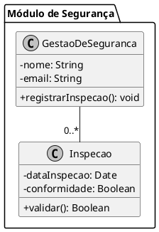

# PlantUML Conventions

These are the strict conventions for writing PlantUML code in the **SafePlace** project.

## Naming and Casing

- **Classes, Interfaces, and Enums**: Use `PascalCase` (e.g., `GestaoDeSeguranca`, `AreaDeRisco`).
- **Attributes and Methods**: Use `camelCase` (e.g., `dataOcorrencia`, `calcularTempoEstimado()`).
- **Language**: All domain concepts must be in Portuguese, exactly as defined in `CONTEXT.md`.

## UML Syntax

### Visibility
Always specify visibility for attributes and methods:
- `+` Public
- `-` Private
- `#` Protected

### Relationships
Be explicit about the type of relationships. Use non-directional associations to reduce clutter.
- **Association**: `ClasseA -- ClasseB` (directionless). Never use `-->` or `<--`.
- **Inheritance**: `SuperClasse <|-- SubClasse`
- **Realization (Interfaces)**: `Interface <|.. Classe`
- **Composition**: `Todo *-- Parte` (The part cannot exist without the whole).
- **Aggregation**: `Todo o-- Parte` (The part can exist independently).

### Multiplicity
- When an association is 1 to N or 1 to 1, **omit the "1"**. Leave it empty. Example: `Funcionario -- "0..*" Ocorrencia`. Never write `"1"` on the "one" side.
- Do not use descriptions or labels on associations (e.g., omit `: realiza`, `: recebe`, `: gerencia >`).

## Formatting and Styling

- Start every snippet with `@startuml` and end with `@enduml`.
- Use `skinparam monochrome true` to ensure all diagrams are black and white.
- Use `skinparam classAttributeIconSize 0` to show text visibility (`+`, `-`) instead of icons.
- Group related classes using `package "Nome do Modulo" { ... }`.

## Ortho Layout (Anti-Overlapping)

Apply an **Ortho Layout** to maintain legibility in dense diagrams:
- **Orthogonal lines**: Use `skinparam linetype ortho` to draw connections without curves.
- **Vertical/Square Structure**: Strive for a vertical or square overall structure.
- **Dynamic Spacing for Associations**: Do not blindly space all classes far apart globally. Instead, dynamically allocate space proportional to a class's number of associations. Make classes with more connections visually larger and their associations more separated (avoiding overlapping lines) by using longer link lengths (e.g., `---`, `----`, `-----`) and explicit direction hints (`-up-`, `-down-`, `-left-`, `-right-`).
- **Cardinality Placement**: To guarantee predictability, force cardinalities to the **left side** when the line is vertical, and to the **bottom** when the line is horizontal. Use explicit direction hints and PlantUML label tricks (like padding or `\n`) if needed to ensure this visual standard is met without exception.

## Example (SafePlace Context)

